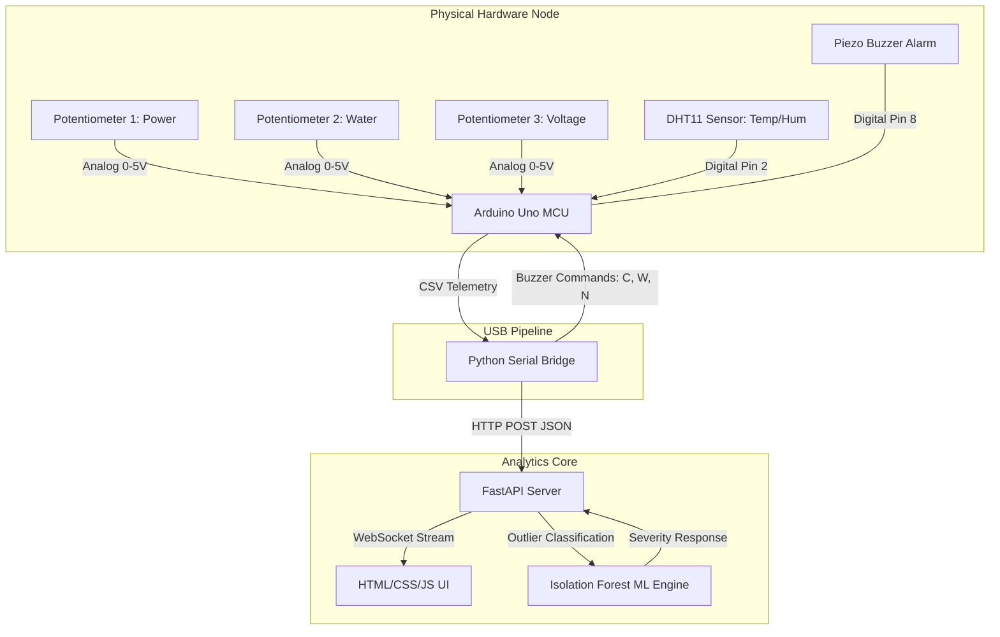

# AEGIS : Arduino Uno Prototype Circuit Schematic

This document contains the wiring schematic and connection pinouts for the physical prototype. It is formatted for inclusion in your report, portfolio, or presentation.

---

## 📷 Circuit Schematic Diagram

---

## 🔌 Connection Map & Pinout Table

All components operate on safe **5V DC power** provided directly by the Arduino Uno's USB connection.

| Component | Component Pin | Arduino Uno Pin | Wire Color (Rec.) | Description / Function |
| :--- | :--- | :--- | :--- | :--- |
| **Potentiometer 1** (Power) | Left Pin Middle Pin (Wiper) Right Pin | **GND** **A0** **5V** | Black Yellow Red | Simulates electrical active power draw (0 – 12.0 kW) |
| **Potentiometer 2** (Water) | Left Pin Middle Pin (Wiper) Right Pin | **GND** **A1** **5V** | Black Blue Red | Simulates hydraulic water flow rate (0 – 30.0 L/min) |
| **Potentiometer 3** (Voltage)| Left Pin Middle Pin (Wiper) Right Pin | **GND** **A2** **5V** | Black Green Red | Simulates utility grid line voltage (160 – 280 V) |
| **DHT11 Sensor** (Weather) | VCC DATA / OUT GND | **5V** **Digital 2** **GND** | Red Orange Black | Measures ambient room temperature and relative humidity |
| **Piezo Buzzer** (Alarm) | Positive Pin (+) Negative Pin (-) | **Digital 8** **GND** | Purple Black | Emits diagnostic alarm beeps ('C' = Critical, 'W' = Warning) |

---

## 📐 System Logic Flowchart

